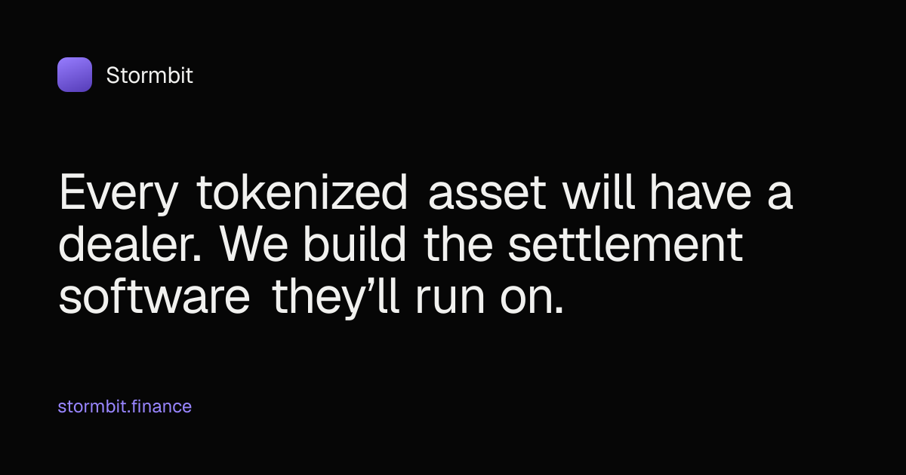

<h1>Stormbit</h1>

Every tokenized asset will have a dealer. Stormbit builds the settlement software they run on.

Non-custodial smart contracts settle income, entry and credit programs on tokenized assets. Terms are priced per transaction by a counterparty, authorized from the holder's own wallet, and applied by the contract at settlement.

## Links

- [Website](https://stormbit.finance)
- [Documentation](https://docs.stormbit.finance)
- [X](https://x.com/StormbitFinance)
